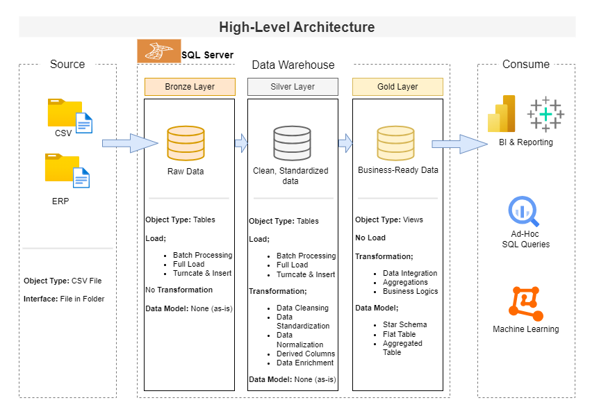

# Data Warehouse and Analytics Project

Welcome to the Data Warehouse and Analytics Project repository!
This portfolio project showcases a robust data warehousing and analytics solution, demonstrating industry best practices in data engineering and analytics. The project encompasses the entire data warehousing lifecycle, from designing and building a data warehouse to generating actionable business insights.

---

## 📖 Project Overview

This project involves:

1. *Data Architecture*: Designing a modern data warehouse using Medallion Architecture (*Bronze*, *Silver*, and *Gold* layers).
2. *ETL Pipelines*: Extracting, transforming, and loading data from source systems into the warehouse.
3. *Data Modeling*: Developing fact and dimension tables optimized for analytical queries.
4. *Analytics & Reporting*: Creating SQL-based reports and Tableau dashboards for actionable insights.
5. *Advanced Analytics*: Performing customer analytics using Python, including *RFM segmentation*, *Customer Lifetime Value (CLV)*, *churn & retention analysis*, and *revenue prioritization* with insights, recommendations, and visuals.

---

## Tools Used
- SQL Server / MySQL
- Tableau
- Python
- Draw.io

---

## Project Requirements

### Building the Data Warehouse (Data Engineering)

#### Objective
Develop a modern data warehouse using MySQL to consolidate sales data, enabling analytical reporting and informed decision making.

#### Specifications
- *Data Sources*: Import data from two source systems (ERP and CRM) provided as CSV files.
- *Data Quality*: Cleanse and resolve data quality issues prior to analysis.
- *Integration*: Combine both sources into a single, user-friendly data model designed for analytical queries.
- *Scope*: Focus on the latest dataset only; historization of data is not required.
- *Documentation*: Provide clear documentation of the data model to support both business stakeholders and analytics teams.

---

### BI: Analytics & Reporting (Data Analytics)

#### Objective
Develop SQL-based analytics to deliver detailed insights into:
- *Customer Behavior*
- *Product Performance*
- *Sales Trends*

These insights empower stakeholders with key business metrics, enabling strategic decision making.

---

### Advanced Analytics (Python)

#### Objective
Extend dashboard-level insights with advanced exploratory data analysis using Python to uncover deeper customer behavior patterns and business opportunities.

#### Key Analyses
- *RFM Segmentation* (Recency, Frequency, Monetary)
- *Customer Lifetime Value (CLV)*
- *Churn & Retention Analysis*
- *Revenue & Customer Value Prioritization*
- *Customer Value & Engagement Action Matrix*
- *Business insights, recommendations, and visual storytelling*

---

## 🏗️ Data Architecture

The data architecture for this project follows Medallion Architecture (*Bronze*, *Silver*, and *Gold* layers):

1. *Bronze Layer*: Stores raw data as-is from the source systems. Data is ingested from CSV files into the SQL Server database.
2. *Silver Layer*: Includes data cleansing, standardization, and normalization processes to prepare data for analysis.
3. *Gold Layer*: Houses business-ready data modeled into a star schema required for reporting and analytics.

---

## 📂 Repository Structure

data-warehouse-project/
│
├── datasets/ # Raw datasets used for the project (ERP and CRM data)
│
├── docs/ # Project documentation and architecture details
│ ├── etl.drawio # ETL techniques and workflows
│ ├── data_architecture.drawio # Overall system architecture
│ ├── data_catalog.md # Dataset catalog and metadata
│ ├── data_flow.drawio # Data flow diagrams
│ ├── data_models.drawio # Star schema data models
│
├── scripts/ # SQL scripts for ETL and transformations
│ ├── bronze/ # Extracting and loading raw data
│ ├── silver/ # Cleaning and transforming data
│ ├── gold/ # Creating analytical models
│
├── analytics/ # Python-based advanced analytics
│ ├── notebooks/ # Jupyter notebooks (RFM, CLV, churn analysis)
│ ├── images/ # Generated visualizations
│ └── README.md # Analytics documentation
│
├── tests/ # Test scripts and data quality checks
│
├── README.md # Project overview and instructions
├── LICENSE # License information for the repository
├── .gitignore # Files and directories to be ignored by Git
└── requirements.txt # Dependencies and requirements for the project

---

## License
This project is licensed under the MIT License. You are free to use, modify, and share this project with proper attribution.

---

## About
Hello! I'm Wisdom Chinemere Mpamugo, also known as Wisdom Analytics.  
As a Data Analyst, I help organizations make data-driven decisions by building scalable data solutions and translating data into actionable insights.

Let's stay in touch! Feel free to connect with me on this platform:
- LinkedIn: (add your public LinkedIn profile URL here)

